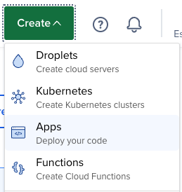
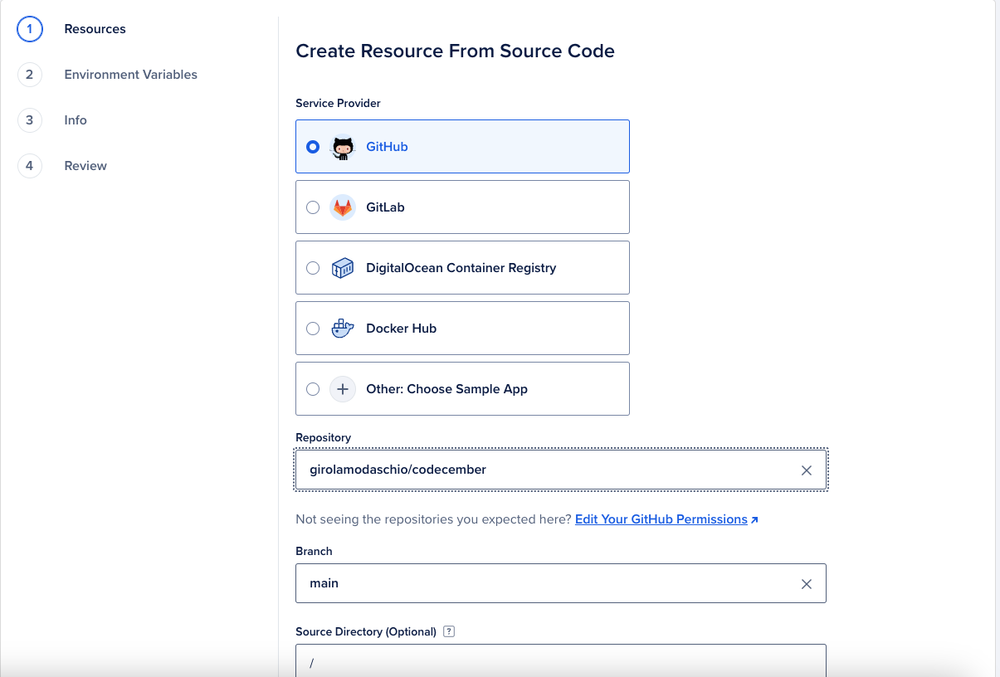
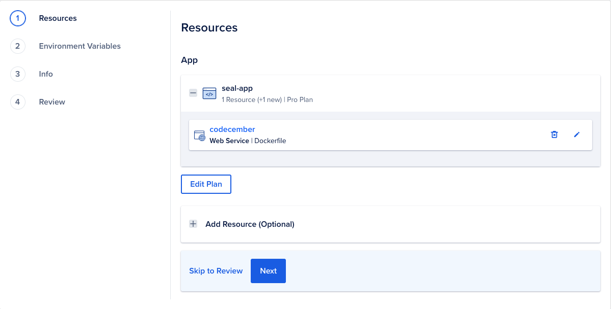
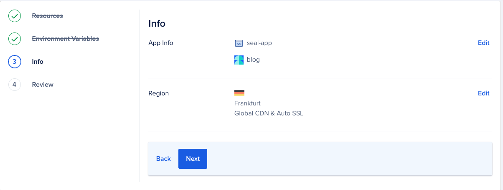
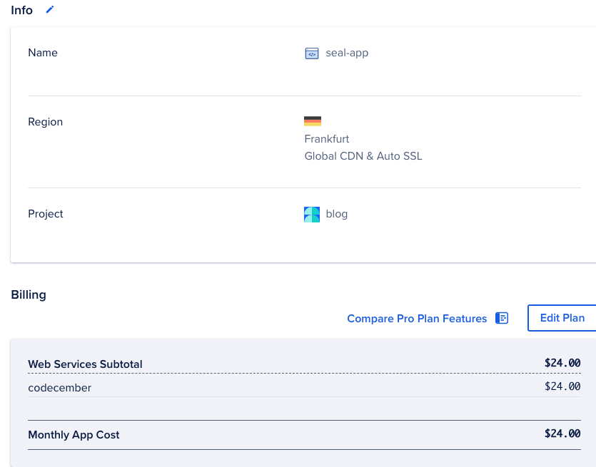
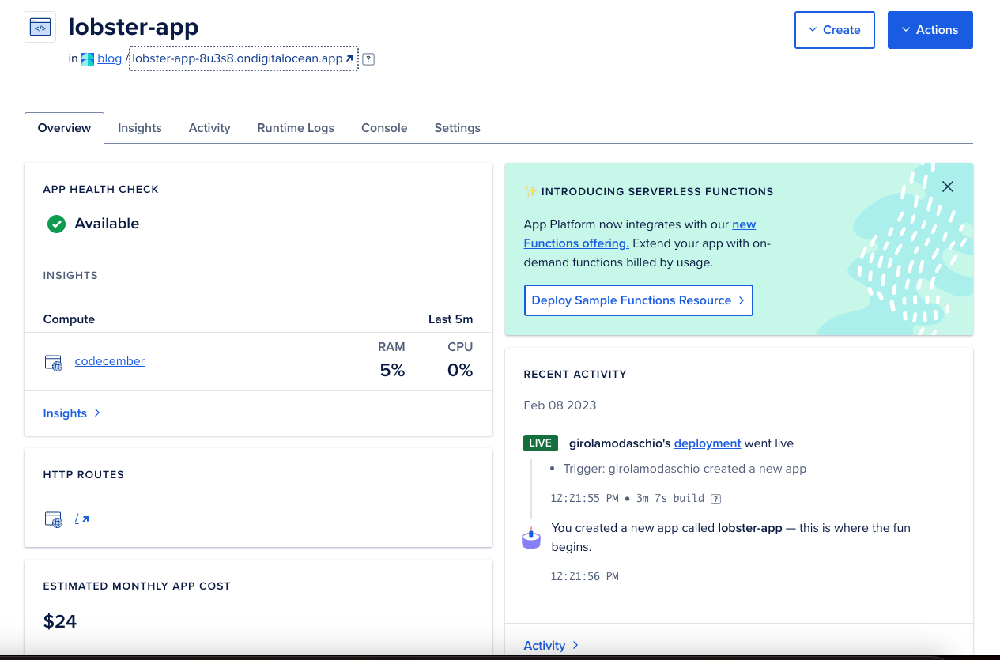
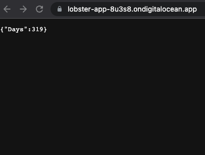

Earlier this month I started a challenge with myself: coding for the sake of coding itself.
Here is what I've discovered:

[1] It's not that easy coding outside of working hours, [2] consequence of one, is not that productive coding by myself.
But this allowed me to discover much more things about my style of coding.
The main difference between me and a graduated engineer is that I think, I achieve solutions by endlessly trying all the things I think would work.
The graduated SRE, I've seen, tends to part with a plan first and then execute it.

So joyful when my intuition helps me drive safely without a plan,
So difficult when my intuitions are wrong and I lose a lot of time tinkering.

### How was this Codecember, then
I didn't accomplish many things, except that I've finally developed an API that tells me how many days I'm going to miss Christmas.
Doing that, I decided I wanted to deploy the application on Cloud and that was the reason why I stopped writing.
1. Cloud Provider Costs a lot of money: how much I available to spend for a hobby? I've enthusiastically joined Azure for its free tier, discovering that not all of its resources are included in the free tier.
2. Not all cloud providers are the same
DigitalOcean offered me a year-long 200$ credit alongside a fixed-cost VM. The exact thing I was searching for. 

Here are the things:
What I'm going to do next?

### How to deploy that Codecember app on a VM?

#### The super-easy way:
* From Digital Ocean click on Create Apps in the top-right menu.

* Select the repository from Github

* Configure the resources

* Configure the information

* Review the plan

Scream, it will cost 24$ per month.
But it works :)

See you in the next post :)