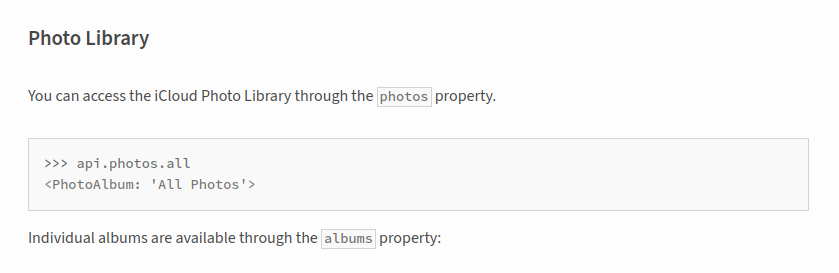

Hello reader! (I know it will be me, as always, but starting each post as future Girolamo is a little bit awkward)

First thing first thing first thing first.
Which data can I get from Icloud and how?
Github here come at help: https://pypi.org/project/pyicloud/ seems an open source project that has a discrete number of downloads, star, fork, and so on.

Also, they have an already prepared API that allows to access the iCloud Photo Library through the photos property.

To log into my iPhoto I need to retrieve:
- my username and my password.
- a properly set Python workspace.

Let’s get this try a shot.

[github.com/girolamodaschio/codecember](https://github.com/girolamodaschio/codecember)