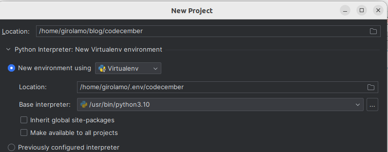
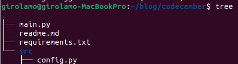

Hello reader,
you were writing from a new computer. So you:
1. Download the community version of your favorite Python IDE.
2. Create a .env folder in your home directory
3. Clone last year's codecember repository, open it with IDE, and place python virtualenv into that file.

4. Install the git toolbox plugin
5. Create a new branch named after codecember 2022 to have a clean space for codecember 2023 in main.
6. Ready to go: install the requirements
pip install pyicloud – to connect to iCloud
pip install python-decouple – to store sensitive data in a file that I’m not going to commit.

As I’ve set a 2 factors authentication, I can’t just connect with my user id and password.
So I follow the guide and I approve.

To start this POC, so far I have created:

Where main.py contains the client as suggested into the pyicloud project.
Where a hidden file contains my data.
Where the connection works.

Follow my work on github!

[github.com/girolamodaschio/codecember](github.com/girolamodaschio/codecember)
