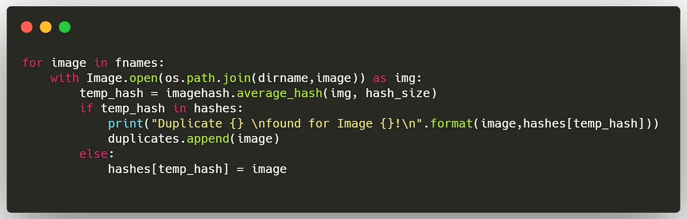

Ok, now I have a repository called Codecember where I have all the images that I’ve downloaded.
Now It’s time to verify the similarities of the images.
Googling a quick and fast way to do so.
I want to avoid OpenCV since I’m probably running this script on a super light resource, I’ve found that the best way would be through hashing.

https://medium.com/@somilshah112/how-to-find-duplicate-or-similar-images-quickly-with-python-2d636af9452f

It seems to work very well on photos of people.
Not working so well with photos of landscapes.
Moreover, on ~ 5000 images, it found only 13 duplicated images.

Maybe I need a double check my work.

Follow my work on github!
[github.com/girolamodaschio/codecember](https://github.com/girolamodaschio/codecember)
